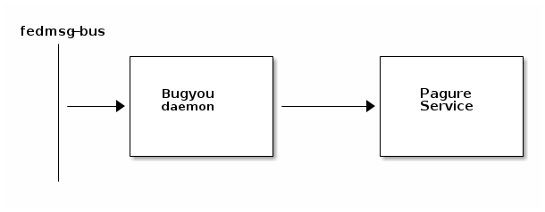

Design
======

Bugyou files issues for failed tests from autocloud. It's part of Fedora Project where it
listens to autocloud messages from fedmsg and files bug for images which have
failed the tests. Bugyou keeps updating the status of the images in the bug and
closes the issue once the tests are successful.

