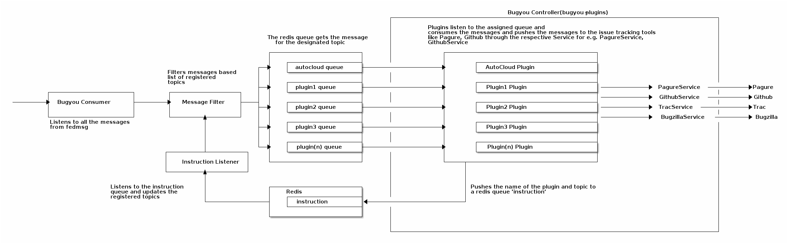

========
Overview
========

Bugyou is a service which listens to fedmsg messages and interacts with the
issue tracking tools through an API.

Bugyou is a fedmsg consumer that keeps listening to fedmsg for all the
messages. Each of the plugin is configured to listen to one or more topics.
The consumer maintains the list of topics and filters all the other messages
other than the topics that is required by the plugins.

Each of the plugin has it's own queue in redis. The filtered message is pushed
to each of the queue. Plugins connected to their designated queue keep consuming 
these messages. The plugins dicards a message if the topic does match to the 
designated topic(s).

Once filtered, the plugins processed the message and uses the service API to
manage a ticket in the issue tracking tools. If we want to track new kind
of fedmsg message and file issue accordingly then we need to go ahead and
write a new plugin.

The plugins are run through a controller which needs to be restarted whenever
there is a new plugin. Once restarted, the controller enqueue the plugins and
topics in an ``instruction`` queue in Redis. On which, the ``BugyouConsumer``
consumes the messages and updates the list of topics to be served accordingly.

